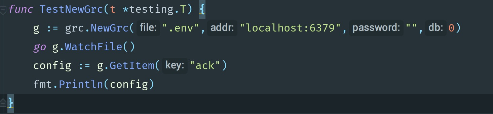

# GRC - golang redis config
GRC是一款使用golang redis 对应用程序的配置文件进行热更新的一款软件，方便在应用程序启动的过程当中实时更新我们的配置文件。

## 使用
可以参考测试文件
````
//使用NewGrc实例化 第一个参数是.env文件 第二个参数是redis地址，第三个参数是redis密码，第四个参数是redis分区号。0就是默认的数据库
//.env是使用kv来设置参数哒
g := grc.NewGrc(".env","localhost:6379","",0)
//监听.env变化。注意：这里需要单独启动一个go程监听文件变化，否则会影响你的主要go程。
go g.WatchFile()
//GetItem获得配置文件。
config := g.GetItem("ack")
fmt.Println(config)
````

## 为什么设计这样一个包？
golang这种编译型语言无法像PHP一样实时的热更新配置数据。为了让golang更加简单的热更新配置文件所以设计制作了GRC这个热更新配置文件的包。
### 思路
具体思路是使用redis内存数据库作为配置的存放容器，然后让golang直接读取redis的数据作为配置数据，更新配置的时候，我们只要去更新redis里面的数据，golang应用程序就可以实时更新了。但是平凡的去操作数据库是危险的，所以本程序额外使用了一个.env的配置文件和php laravel的配置文件类似，GRC会新启动一个go程去监听.env的变化，GRC初始化的时候会先将.env的数据以KV的形式存入redis，如果.env发生变化，GRC会更新redis当中的配置列表。这样做的好处是，我们可以在外部使用编辑器更新配置文件，同时又不同golang程序去读取.env文件，相比读取磁盘上的配置文件，读取redis内存当中的数据速度要快很多，否则频繁的打开和关闭.env会造成磁盘性能的损耗。

### 不使用redis作为配置容器的一些常规方法
1.我们可以在项目目录当中配置一个config.go的文件，每次修改的时候修改这个文件的内容，然后重新编译项目。
2.我们可以写一个外部的yaml文件，每次都让golang应用去读取yaml读取配置。这样也可以热更新，但是问题就像上面说的，会频繁的触发磁盘IO操作。
3.我们可以让golang应用监听一个配置channel，然后我们用golang编写另外一个cli程序如果需要修改配置的时候就向这个管道写入数据，然后golang应用就去更新配置变量。

以上是我可以想到的方法都有利有弊，相对来说我觉得使用redis更省事，所以GRC的方案也不错。以上欢迎指教和star